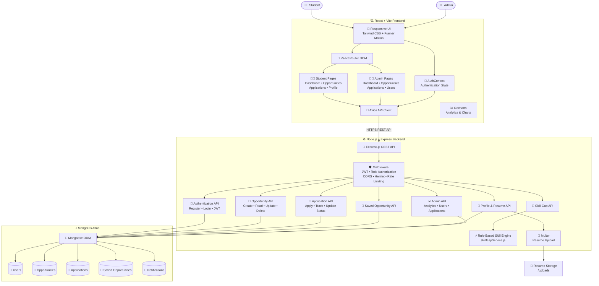

# 🚀 CampusFlow AI

### Smart Campus Career & Opportunity Management Platform

<p align="center">
  
  
  
  
  
</p>

<p align="center">
  <b>A modern career management platform that helps students discover opportunities, track applications, analyze skill gaps, manage resumes, and monitor their career progress.</b>
</p>

---

## 🌐 Live Project

### 🖥️ Frontend

🔗 **Live Website:**  
https://campusflow-ai.netlify.app/

### ⚙️ Backend API

🔗 **Backend Health Check:**  
https://campusflow-ai-backend.onrender.com/api/health

### 💻 GitHub Repository

🔗 **Source Code:**  
https://github.com/VedantWasalwar/CampusFlow-AI

---

# 📸 Project Screenshots

## 🏠 Landing Page

<!-- Add screenshot here -->

<p align="center">
  
</p>

---

## 📊 Student Dashboard

<!-- Add dashboard screenshot here -->

<p align="center">
  
</p>

---

## 💼 Opportunities

<p align="center">
  
</p>

---

## 📈 Application Tracker

<p align="center">
  
</p>

---

## 🧠 AI Skill Gap Analyzer

<p align="center">
  
</p>

---

## 👨‍💼 Admin Dashboard

<p align="center">
  
</p>

> 📌 To add screenshots, create a `screenshots` folder in the root directory and place the images inside it.

Example:

```text
CampusFlow-AI/
│
├── client/
├── server/
├── screenshots/
│   ├── landing-page.png
│   ├── student-dashboard.png
│   ├── opportunities.png
│   ├── application-tracker.png
│   ├── skill-analyzer.png
│   └── admin-dashboard.png
│
├── README.md
└── LICENSE

## 🏗️ Architecture Diagram


